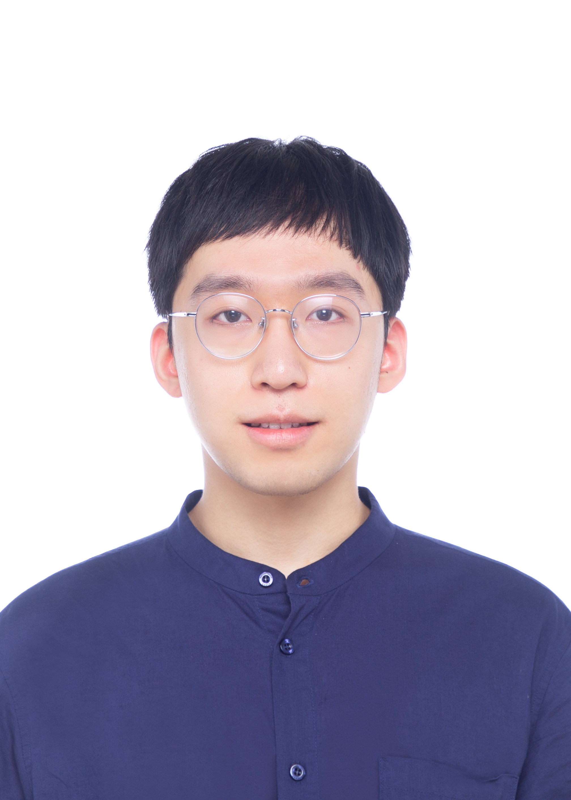

# 李奇 (Qi Li) - 中文简历

 
<h2>李奇 (Qi Li)</h2>

<strong>清华大学机械工程博士研究生</strong>

研究方向：机械装备智能诊断技术 | 学术成就：总被引用 700+ 次

---

## 个人基本信息

| **基本信息** | **联系方式** |
|-------------|-------------|
| 🎂 **生日：** 1997年7月 | 📞 **手机：** 18896782803 |
| 🏳️ **民族：** 汉族 | ✉️ **邮箱：** liq22@tsinghua.org.cn |
| 📍 **籍贯：** 浙江温州 | 🌐 **个人主页：** [liq22.github.io](https://liq22.github.io) |
| 🏛️ **政治面貌：** 中共党员 | 🆔 **ORCID：** 0000-0001-7105-2818 |

---

## 🎓 教育与研究经历

### 博士研究阶段 (2022年9月-至今)
**🏛️ 清华大学 机械工程博士**
- **导师：** 秦朝烨教授
- **研究方向：** 可信AI、基础模型、故障诊断
- **学术成果：** 8+篇JCR Q1论文，700+引用
- **奖学金：** 未来学者奖学金

### 硕士研究阶段 (2019年9月-2022年6月)
**🏛️ 苏州大学 控制理论与控制工程硕士**
- **导师：** 陈良教授、沈长青教授
- **研究重点：** 跨域故障诊断
- **成果：** 3篇ESI高被引论文 | 优秀毕业生 | 国家奖学金

### 本科学习阶段 (2015年9月-2019年6月)
**🏛️ 苏州大学 电气工程及其自动化学士**
- 优秀毕业生 | 开学典礼新生代表发言人

---

## 📚 访问学者经历

### 🌍 耶鲁大学统计与数据科学系 (2025年4月-2025年9月)
- **导师：** Lu Lu 教授
- **研究：** 物理信息神经网络、基础模型

### 🧪 清华大学人工智能产业研究院 (2022年4月-2022年9月)
- **导师：** 李元春 教授
- **研究：** AI时间序列分析、工业机器学习

---

## 🧠 研究领域

| 领域 | 描述 |
|------|------|
| **🧠 智能监测健康管理** | 设备健康状态监测与预测维护 |
| **⚙️ 可信人工智能** | 可解释AI、神经符号推理 |
| **🔧 物理信息基础模型** | 物理约束深度学习、基础模型 |

---

## 🏆 主要荣誉

| 年份 | 荣誉奖项 |
|------|----------|
| 2024 | 🏆 首批科协青年托举人才（博士） |
| 2024 | 🥈 振动工程协会科学技术二等奖 |
| 2023 | 💰 清华大学社会实践奖学金 |
| 2022 | 🌟 清华大学未来学者奖学金 |
| 2021 | 👑 国家奖学金 |
| 2020 | 👑 国家奖学金 |

---

 
<small>扫码访问个人主页</small>

---

**第 1 页**

---

# 李奇 (Qi Li) - 中文简历 (第2页)

## 🔖 代表性研究

### 🎯 PHM Foundation Model
**提出即插即用模块实现统一故障诊断基础模型架构**
- **核心贡献：** HSE模块用于统一故障诊断的即插即用架构
- **发表期刊：** *Information Fusion* 2025 (中科院一区TOP，**IF: 15.5**)

### 🧠 Neural-Symbolic Diagnosis
**融合神经网络与符号推理，构建可解释的故障诊断方法**
- 透明信息融合网络 (*Advanced Engineering Informatics* 2025, **IF: 8.5**)
- 深度专家网络 (*Journal of Manufacturing Systems* 2024, **IF: 17.6**)
- 透明算子网络 (*IEEE Transactions on Industrial Informatics* 2024, **IF: 12.3**)

### 🔄 Cross-Domain Diagnosis  
**开发域适应与泛化方法，解决跨工况故障诊断难题**
- 跨域增强诊断 (*Reliability Engineering & System Safety* 2023, **IF: 9.4**, **高被引🌟**)
- 对抗域不变泛化 (*IEEE Trans. Industrial Informatics* 2022, **IF: 12.3**, **高被引🌟**)
- 知识映射对抗域适应 (*Mechanical Systems and Signal Processing* 2021, **IF: 8.4**, **高被引🌟**)

---

## 📄 学术论文

### 🆕 2025年最新成果
**[1]** **Q. Li**, B. Chen, Q. Chen, X. Li, Z. Qin, and F. Chu, "HSE: A Plug-and-Play Module for Unified Fault Diagnosis Foundation Models," *Information Fusion*, 2025. (中科院一区TOP，**IF: 15.5**)

**[2]** **Q. Li**, L. Qin, H. Xu, Q. Lin, Z. Qin, and F. Chu, "Transparent information fusion network: An explainable network for multi-source bearing fault diagnosis via self-organized neural-symbolic nodes," *Advanced Engineering Informatics*, 2025. (JCR Q1, **IF: 8.5**)

### 🔥 2024年核心成果
**[3]** **Q. Li**, Y. Liu, S. Sun, Z. Qin, and F. Chu, "Deep expert network: A unified method toward knowledge-informed fault diagnosis via fully interpretable neuro-symbolic AI," *J. Manuf. Syst.*, vol. 77, pp. 652–661, Dec. 2024. (中科院一区TOP，**IF: 17.6**)

**[4]** **Q. Li**, H. Li, W. Hu, S. Sun, Z. Qin, and F. Chu, "Transparent Operator Network: A Fully Interpretable Network Incorporating Learnable Wavelet Operator for Intelligent Fault Diagnosis," *IEEE Trans. Ind. Inf.*, 2024. (中科院一区TOP, **IF: 12.3**)

### ⭐ 高被引重点论文
**[5]** **Q. Li**, L. Chen, L. Kong, D. Wang, M. Xia, and C. Shen, "Cross-domain augmentation diagnosis: An adversarial domain-augmented generalization method for fault diagnosis under unseen working conditions," *Reliab Eng Syst Saf*, vol. 234, p. 109171, 2023. (中科院一区TOP, **IF: 9.4**, ESI高被引🌟，**被引51次**)

**[6]** 陈良 (导师), **Q. Li**, C. Shen et al. "Adversarial domain-invariant generalization: A generic domain-regressive framework for bearing fault diagnosis under unseen conditions," *IEEE Trans. Ind. Informatics*, 2022. (中科院一区TOP, **IF: 12.3**, ESI高被引🌟，**被引135次**)

**[7]** **Q. Li**, C. Shen, 陈良, et al. "Knowledge mapping-based adversarial domain adaptation: A novel fault diagnosis method with high generalizability under variable working conditions," *Mech. Syst. Signal Process.*, vol. 147, 2021. (中科院一区TOP, **IF: 8.4**, ESI高被引🌟，**被引130次**)

---

## 📝 学术服务与项目应用

| **学术服务** | **项目应用** |
|-------------|-------------|
| 📖 Information Fusion | ✈️ 某型号飞机减振降噪分析 |
| 📖 IEEE Trans. Industrial Informatics (TII) | ⚡ 水电站智能运维技术 |
| 📖 Mechanical Systems and Signal Processing (MSSP) | 💻 PHMBench开源项目组负责人 |
| 📖 Advanced Engineering Informatics | |
| 📖 IEEE Trans. Industrial Electronics (TIE) | **社会活动** |
| 📖 IEEE Trans. Instrumentation and Measurement | 🎤 苏州大学开学典礼新生代表发言 |
| 📖 Measurement Science and Technology (MST) | 👔 苏州大学机电学院研究生班长 |
| | 🤝 IFToMM会议志愿者 |

---

**第 2 页**